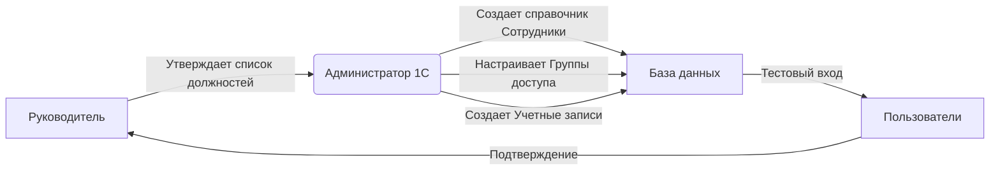

# 📘 Инструкция: Первоначальная настройка прав доступа в 1С
**ООО «КБМ» | Версия документа: 1.1 | Дата: 21.03.2026**

| **Ответственный** | Администратор 1С / Руководитель проекта |
| :--- | :--- |
| **Цель** | Настройка системы безопасности, создание пользователей и разграничение прав доступа для производственного персонала. |
| **Статус** | ✅ Готово к внедрению |

---

## 1. 🎯 Цели и Задачи

Данный документ регламентирует действия администратора при старте системы. Корректная настройка на этом этапе гарантирует:
*   🔒 **Безопасность данных:** Сотрудники видят только то, что нужно для работы.
*   🏭 **Изоляцию цехов:** Мастера не видят задания смежных участков.
*   💰 **Защиту финансовой информации:** Производственный персонал не имеет доступа к ценам закупки и зарплате других отделов.
*   🚀 **Быстрый старт:** Пользователи сразу получают доступ к своим рабочим местам.

> ⛔ **ВАЖНО:** Все настройки выполняются **ДО** начала ввода оперативных документов. Изменение прав «на ходу» при активной работе может привести к ошибкам доступа и блокировке документов.

---

## 2. 👥 Схема взаимодействия

---

## 3. 🛠 Этап 1: Подготовка конфигурации

Прежде чем создавать пользователей, необходимо активировать нужный функционал. Без этого некоторые пункты меню будут скрыты.

**Путь:** `Настройки` → `Общие настройки` → `Вкладка "Больше возможностей: настройка программы"`

### 3.1. Чек-лист обязательных опций

| Раздел | Опция | Статус | 💡 Комментарий для КБМ |
| :--- | :--- | :---: | :--- |
| **Продажи** | Заказы покупателей | ✅ | Основа работы отдела продаж |
| **Продажи** | Коммерческие предложения | ✅ | Для участия в тендерах |
| **Закупки** | Партии номенклатуры | ✅ | **Критично!** Прослеживаемость металла |
| **Закупки** | Характеристики номенклатуры | ✅ | Разные типоразмеры наконечников |
| **Склад** | Несколько складов | ✅ | Разделение: Сырье, Цеха, Готовая продукция |
| **Склад** | Ордерные склады | ⬜ | Включать только если есть зона приемки/отгрузки отдельно от хранения |
| **Производство** | Производство | ✅ | **Критично!** Базовый блок |
| **Производство** | Технологические операции | ✅ | Для детального учета этапов (токарка, сборка) |
| **Производство** | Рабочие центры | ⬜ | Включить, если нужно планировать загрузку станков по времени |
| **Персонал** | Зарплата и кадры | ✅ | Для расчета сдельной оплаты рабочим |
| **Финансы** | Себестоимость | ✅ | **Критично!** Расчет стоимости изделия |
| **CRM** | CRM | ✅ | История взаимодействий с клиентами |

> ⚠️ **Внимание:** После включения опций может потребоваться перезапуск базы 1С в режиме «Предприятие».

### 3.2. Создание структуры складов (НЗП)

Для корректного учета незавершенного производства (НЗП) создадим виртуальные кладовые для цехов.

**Путь:** `НСИ и Администрирование` → `Склады и магазины` → `Склады` → `Создать`

| Наименование | Тип склада | Назначение |
| :--- | :--- | :--- |
| `Основной склад (Сырье)` | Склад | Хранение металла и комплектующих |
| `Цех Токарный (НЗП)` | Кладовая | Детали в обработке |
| `Цех Сборочный (НЗП)` | Кладовая | Узлы в сборке |
| `Склад ОТК` | Кладовая | Продукция на проверке |
| `Склад Готовой Продукции` | Склад | Товары на отгрузку |

### 3.3. Настройка статей затрат

**Путь:** `Финансовый результат и контроллинг` → `Статьи затрат` → `Создать`

Необходимо создать минимум 4 статьи для корректного расчета себестоимости:
1.  📦 **Материалы** (Тип: *Материальные расходы*) — для списания металла.
2.  👷 **Зарплата производственная** (Тип: *Оплата труда*) — для сдельщиков.
3.  ⚡ **Энергия и амортизация** (Тип: *Прочие расходы*) — общепроизводственные затраты.
4.  🏢 **АУП и офис** (Тип: *Прочие расходы*) — общехозяйственные затраты.

---

## 4. 🔐 Этап 2: Настройка групп доступа (Ролевая модель)

В 1С права настраиваются через **Группы доступа**. Мы будем использовать готовые шаблоны системы, модифицируя их под нужды КБМ.

**Путь:** `Администрирование` → `Настройка пользователей и прав` → `Группы доступа`

### 4.1. Алгоритм создания группы
1.  Нажать `Создать`.
2.  Выбрать шаблон (например, «Менеджер по продажам»).
3.  Дать понятное имя (например, `КБМ - Менеджер по продажам`).
4.  Настроить состав прав (галочки в списке).
5.  **Важно:** Настроить ограничения (см. п. 4.3).

### 4.2. Матрица профилей для ООО «КБМ»

| Роль | Базовый шаблон | Разрешено ✅ | Запрещено ❌ |
| :--- | :--- | :--- | :--- |
| **Менеджер по продажам** | `Менеджер по продажам` | Продажи, CRM, Клиенты, КП | Закупки (цены), Производство, Финансы |
| **Снабженец** | `Менеджер по закупкам` | Закупки, Поставщики, Склад (остатки) | Продажи (цены), Производство, Зарплата |
| **Технолог** | `Конструктор / Технолог` | Номенклатура, Спецификации, Тех. карты | Закупки (цены), Продажи, Зарплата |
| **Инженер ПДО** | `Менеджер по производству` | Планирование, Потребности, Заказы пр-ва | Финансы, Зарплата (конкретные суммы) |
| **Мастер цеха** | `Производитель` (новый) | Наряд-задания (свои), Отчеты пр-ва, Требования | Все финансы, Закупки, Продажи, Чужие цеха |
| **Кладовщик** | `Кладовщик` | Складские документы, Инвентаризация | Производство (редактирование), Финансы |
| **ОТК** | `Контроль качества` (новый) | Акты контроля, Браковка | Создание документов пр-ва, Финансы |
| **Экономист** | `Руководитель` + права | Все отчеты, Себестоимость, Нормативы | Проведение документов (только чтение) |
| **Главный инженер** | `Руководитель производства` | Всё производство, Спецификации, Планы | Регламентированный учет (БУ), Банк, Касса |
| **Директор** | `Руководитель` | Все отчеты, Монитор руководителя | Проведение документов (опционально) |

### 4.3. 🔒 Настройка ограничений (RLS) — Критический этап!

Чтобы мастер цеха не видел чужие заказы, а менеджер — чужих клиентов, используем механизм **«Ограничение доступа на уровне записей»**.

**Путь:** `Администрирование` → `Настройка пользователей и прав` → `Ограничение доступа на уровне записей` → `Включить галочку`.

#### Пример настройки для Мастера цеха:
1.  Зайти в созданную группу `КБМ - Мастер цеха`.
2.  Перейти на вкладку `Ограничения доступа`.
3.  Нажать `Добавить` → Выбрать объект ограничения: `Рабочий центр` или `Подразделение` (в зависимости от того, как привязаны наряды).
4.  Условие: `Подразделение` = `Токарный цех`.
5.  Сохранить.

> ✅ **Результат:** Пользователь из этой группы увидит в списках только документы, относящиеся к Токарному цеху.

---

## 5. 👤 Этап 3: Создание пользователей

> ⚠️ **ВНИМАНИЕ:** Перед созданием пользователя в системе **должна быть создана карточка Сотрудника**!

### 5.1. Шаг 1: Заведение сотрудника
**Путь:** `Люди` → `Сотрудники` → `Создать`.
Заполнить ФИО, Должность, Подразделение. Сохранить.

### 5.2. Шаг 2: Создание учетной записи
**Путь:** `Администрирование` → `Настройка пользователей и прав` → `Пользователи` → `Создать`.

| Поле | Значение | Рекомендация |
| :--- | :--- | :--- |
| **Имя** | `ivanov_ii` | Латиницей, без пробелов |
| **Полное имя** | `Иванов Иван Иванович` | Для отображения в журналах |
| **Сотрудник** | `Иванов И.И.` | Связь с карточкой из п. 5.1 |
| **Аутентификация** | `1С:Предприятие` | Стандартный вариант |
| **Пароль** | `TempPass123!` | Установить сложный временный пароль |
| **Группа доступа** | `КБМ - Мастер цеха` | Выбрать профиль из Этапа 2 |

> 🔐 **Политика безопасности:**
> В разделе `Администрирование` → `Настройки пользователей и прав` → `Парольная политика`:
> *   ✅ Требовать сложность пароля.
> *   ✅ Требовать смену пароля при первом входе.
> *   ✅ Блокировать после 5 неудачных попыток.

### 5.3. Реестр пользователей (Шаблон)

| ФИО | Должность | Логин | Группа доступа | Ограничение (RLS) |
| :--- | :--- | :--- | :--- | :--- |
| Петров П.П. | Менеджер | `petrov_pp` | КБМ - Менеджер по продажам | Свои клиенты |
| Иванов И.И. | Мастер | `ivanov_ii` | КБМ - Мастер цеха | Цех №1 (Токарный) |
| Сидоров С.С. | Мастер | `sidorov_ss` | КБМ - Мастер цеха | Цех №2 (Сборочный) |
| ... | ... | ... | ... | ... |

---

## 6. 🧪 Этап 4: Тестирование и приемка

Не переходите к вводу остатков, пока не пройдете этот этап!

### 6.1. Чек-лист проверки
1.  [ ] **Вход в систему:** Попробовать войти под каждым новым пользователем.
2.  [ ] **Смена пароля:** Убедиться, что система требует сменить временный пароль.
3.  [ ] **Проверка видимости:**
    *   Зайти под **Мастером цеха №1**. Убедиться, что он **НЕ видит** наряды цеха №2.
    *   Зайти под **Менеджером**. Убедиться, что он **НЕ видит** цены закупки в документах (если настроено).
    *   Зайти под **Экономистом**. Убедиться, что он может сформировать отчет «Себестоимость», но не может провести «Заказ поставщику».
4.  [ ] **Создание документа:** Каждый пользователь должен создать один тестовый документ своего типа (черновик) и убедиться, что кнопка «Провести» активна (или неактивна, если запрещено).

> 🛑 **СТОП-ФАКТОР:** Если мастер цеха видит лишнее — вернуться в п. 4.3 и проверить настройки RLS.

---

## 7. 🔗 Этап 5: Синхронизация с 1С:Бухгалтерией (3.0)

Если бухгалтерский учет ведется в отдельной базе 1С:Бухгалтерия.

**Путь:** `Администрирование` → `Синхронизация данных`

1.  Нажать `Настроить синхронизацию данных`.
2.  Выбрать тип: `1С:Бухгалтерия предприятия 3.0`.
3.  Выбрать способ подключения:
    *   🌐 **Прямое подключение:** Если базы в одной локальной сети (рекомендуется для скорости).
    *   💾 **Через файлы:** Если базы на разных компьютерах без сети.
4.  **Настройка правил обмена:**
    *   ✅ Номенклатура, Контрагенты, Договоры (двусторонний обмен).
    *   ✅ Документы реализации и поступления (для отражения в бухучете).
    *   ⬜ Зарплата (обычно выгружается отдельно в специализированные конфигураторы, уточнить у бухгалтера).
5.  Выполнить **первичную выгрузку**.

---

## 8. ✅ Итоговый контрольный лист

Перед передачей системы в эксплуатацию убедитесь:

| № | Действие | Статус | Ответственный |
| :--- | :--- | :---: | :--- |
| 1 | Функциональные опции включены | ⬜ | Администратор |
| 2 | Склады и статьи затрат созданы | ⬜ | Администратор |
| 3 | Группы доступа настроены (включая RLS) | ⬜ | Администратор |
| 4 | Карточки сотрудников заведены | ⬜ | Кадровик/Админ |
| 5 | Пользователи созданы, пароли выданы | ⬜ | Администратор |
| 6 | Тестовый вход выполнен успешно | ⬜ | Все пользователи |
| 7 | Синхронизация с Бухгалтерией настроена | ⬜ | Администратор |

---
*Документ разработан для внутреннего использования ООО «КБМ». Копирование без согласования запрещено.*