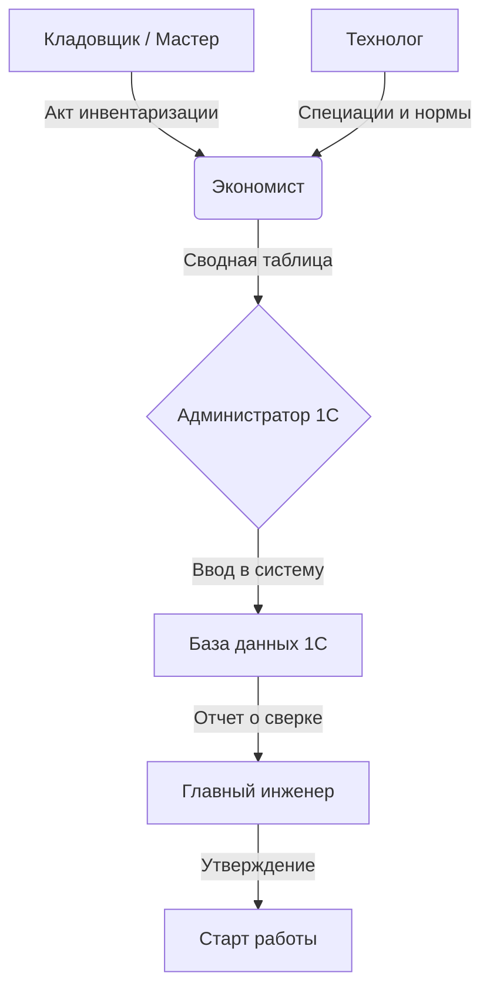

# 📦 Инструкция: Ввод начальных остатков в 1С:УНФ
**ООО «КБМ» | Версия документа: 1.0 | Дата: 21.03.2026**

| **Ответственные** | Экономист, Кладовщики, Мастера цехов, Технолог |
| :--- | :--- |
| **Цель** | Корректный перенос остатков ТМЦ, НЗП и нормативной базы на дату начала эксплуатации. |
| **Важное условие** | 💰 Деньги, взаиморасчеты, налоги и зарплата АУП **НЕ вводятся вручную**. Они загрузятся из 1С:Бухгалтерии и 1С:ЗУП через синхронизацию. |
| **Статус** | ✅ Готов к исполнению |

---

## 1. 🎯 Цель и ключевые принципы

Данный документ регламентирует действия сотрудников при старте системы. От качества ввода данных на этом этапе зависит вся дальнейшая работа производства.

### 🔑 Ключевые принципы
1.  **Дата отсечения:** Остатки вводятся по состоянию на последний день месяца, предшествующего началу учета.
    *   *Пример:* Старт работы **1 апреля** → Остатки вводим на **31 марта**.
2.  **Объем данных в УНФ:**
    *   ✅ **Вводим:** Материальные остатки (сырье, НЗП, готовая продукция), спецификации, нормы расхода.
    *   ❌ **Не вводим:** Деньги (касса/банк), долги контрагентов, ОС, нематериальные активы, зарплату АУП.
3.  **Зарплата рабочих:** Начисляется в УНФ автоматически по факту выработки (сдельные наряды). Начальные остатки по невыплаченной зарплате не вводятся (ведутся в 1С:ЗУП).

> ⛔ **ВАЖНО:** Ошибки на этапе ввода остатков приведут к неверному расчету себестоимости, сбоям в планировании закупок и искажению финансового результата. Проверка данных обязательна!

---

## 2. 👥 Схема взаимодействия

### Роли и задачи:
*   **Кладовщик / Мастер цеха:** Проводят физическую инвентаризацию, заполняют акты с количеством.
*   **Технолог:** Подготавливает актуальные спецификации и нормы расхода.
*   **Экономист:** Сверяет акты, определяет себестоимость единиц, сводит данные в единую таблицу.
*   **Администратор 1С:** Непосредственно вносит данные в систему.
*   **Главный инженер:** Финальное утверждение корректности введенных данных.

---

## 3. 📋 Этап 1: Подготовка данных (Оффлайн)

Перед входом в 1С необходимо подготовить бумажные или электронные акты инвентаризации.

### 3.1. Перечень необходимых документов

| Вид остатков | Ответственный | Документ | Обязательные реквизиты |
| :--- | :--- | :--- | :--- |
| **Склад сырья** | Кладовщик + Снабженец | Акт инвентаризации ТМЦ | Номенклатура, Кол-во, **Себестоимость за ед.** |
| **НЗП (Цеха)** | Мастер цеха + Экономист | Акт инвентаризации НЗП | Полуфабрикаты, Кол-во, Стадия готовности, Себестоимость |
| **Готовая продукция** | Кладовщик ГП | Акт инвентаризации ГП | Номенклатура, Кол-во, Производственная себестоимость |
| **Нормативы** | Технолог | Карты спецификаций | Состав изделия, нормы материалов, трудоемкость операций |

### 3.2. Особенности учета НЗП (Незавершенное производство)

НЗП — это материалы, переданные в цех, но еще не ставшие готовым изделием. В 1С:УНФ они хранятся на специальных складах типа **«Кладовая»**.

> 💡 **Пример для КБМ:**
> В токарном цехе лежат:
> 1.  **200 кг стали 40Х** (еще не точили) → Вводится как материал на складе `Цех №1 (Кладовая)`.
> 2.  **10 шт. полуфабрикатов** (уже проточены, ждут сборки) → Вводится как номенклатура «Полуфабрикат НБ-120» на складе `Цех №1 (Кладовая)` с оценкой стоимости обработки.

---

## 4. 🛠 Этап 2: Проверка справочников

Перед вводом остатков убедитесь, что в системе созданы все необходимые элементы.

### 4.1. Справочник «Номенклатура»
**Путь:** `НСИ и Администрирование` → `Номенклатура`

Проверить наличие:
*   ✅ Всех марок металла (сталь 40Х, 09Г2С и т.д.).
*   ✅ Комплектующих и расходников.
*   ✅ Полуфабрикатов (промежуточные изделия).
*   ✅ Готовой продукции (наконечники, оборудование).
*   ✅ Единиц измерения (кг, шт, м).

### 4.2. Справочник «Склады»
**Путь:** `НСИ и Администрирование` → `Склады и магазины` → `Склады`

Должны быть созданы склады с правильными типами:

| Наименование | Тип склада | Назначение |
| :--- | :--- | :--- |
| `Склад сырья` | Склад | Хранение металла и комплектующих |
| `Цех №1 (Токарный)` | **Кладовая** | Учет НЗП токарного участка |
| `Цех №2 (Сборочный)` | **Кладовая** | Учет НЗП сборочного участка |
| `Склад ОТК` | Кладовая | Продукция на контроле качества |
| `Склад готовой продукции` | Склад | Товары на отгрузку |

> ⚠️ **Внимание:** Если склад не создан или выбран неверный тип (например, «Склад» вместо «Кладовая» для цеха), корректный учет НЗП будет невозможен.

---

## 5. 🚀 Этап 3: Пошаговый алгоритм ввода

### 5.1. Запуск помощника ввода остатков
**Путь:** `Компания` → `Начальные остатки` → `Ввод начальных остатков`
*(Если кнопка не активна, возможно, дата начала работы уже установлена в параметрах системы).*

1.  Нажать **«Продолжить ввод остатков»** или **«+ Создать»**.
2.  Проверить параметры:
    *   **Организация:** ООО «КБМ».
    *   **Дата начала учета:** 01.04.2026 (первый рабочий день).
    *   **Дата остатков:** 31.03.2026 (система подставит автоматически).

### 5.2. Ввод товарных остатков (Основной этап)

Ввод производится последовательно для каждого склада.

#### 📍 Шаг А: Склад сырья
1.  В списке складов выбрать `Склад сырья`.
2.  Заполнить табличную часть данными из акта инвентаризации:

| Номенклатура | Количество | Цена (себестоимость) | Сумма |
| :--- | :--- | :--- | :--- |
| Сталь 40Х (лист) | 2 500 кг | 120,00 ₽ | 300 000 ₽ |
| Электроды УОНИ | 50 кг | 200,00 ₽ | 10 000 ₽ |

> 💰 **Важно:** Цена должна быть **фактической себестоимостью** (без НДС, если компания на ОСНО). Без цены система не сможет рассчитать себестоимость будущего выпуска.

#### 📍 Шаг Б: НЗП (Цеховые кладовые)
1.  Выбрать склад `Цех №1 (Токарный)`.
2.  Внести материалы, находящиеся в работе, и полуфабрикаты:

| Номенклатура | Количество | Цена (оценка) | Сумма |
| :--- | :--- | :--- | :--- |
| Сталь 40Х (заготовка) | 200 кг | 120,00 ₽ | 24 000 ₽ |
| Полуфабрикат НБ-120 | 10 шт | 3 500,00 ₽ | 35 000 ₽ |

> ⚙️ **Нюанс:** Для полуфабрикатов цена включает стоимость материала + стоимость выполненной обработки (оценивается экономистом).

#### 📍 Шаг В: Готовая продукция
1.  Выбрать склад `Склад готовой продукции`.
2.  Внести готовые изделия по производственной себестоимости (без торговой наценки).

### 5.3. Массовая загрузка из Excel (Рекомендуется)
Если позиций много (более 20-30), используйте загрузку из файла.
1.  В форме ввода нажать кнопку **Еще** → **Загрузить из файла**.
2.  Подготовить Excel-файл со столбцами: `Номенклатура`, `Количество`, `Цена`, `Склад`.
3.  Загрузить файл и проверить соответствие колонок.

### 5.4. Пропуск финансовых остатков
Помощник предложит ввести остатки денег и расчетов.
*   **Действие:** Нажать **«Далее»**, ничего не заполняя.
*   **Причина:** Эти данные придут автоматически из 1С:Бухгалтерии после настройки синхронизации. Дублирование приведет к ошибкам.

### 5.5. Завершение
Нажать кнопку **«Закончить»** (или «Финиш»). Система сформирует и проведет документы «Оприходование товаров» датой 31.03.2026.

---

## 6. 🔍 Этап 4: Контроль корректности

Не переходите к работе, пока не пройдете проверку!

### 6.1. Сверка остатков ТМЦ
**Путь:** `Склад и доставка` → `Отчеты` → `Остатки товаров`
*   Сформировать отчет на 01.04.2026.
*   Сравнить суммы и количества с подписанными актами инвентаризации.
*   ⛔ **Стоп-фактор:** Наличие отрицательных остатков (красные цифры). Требуется немедленное исправление.

### 6.2. Сверка НЗП
**Путь:** `Производство` → `Отчеты` → `Незавершенное производство`
*   Проверить, что материалы числятся именно на тех складах-кладовых, где они физически находятся.

### 6.3. Контроль баланса
В форме помощника ввода есть ссылка **«Контроль баланса ввода остатков»**.
*   Убедиться, что сумма введенных активов соответствует данным бухгалтерского учета (для сверки с главбухом).

---

## 7. 📐 Этап 5: Ввод спецификаций (Нормативная база)

Без спецификаций производство в 1С работать не будет.

**Путь:** `НСИ и Администрирование` → `Номенклатура` → Открыть карточку изделия → Вкладка `Спецификации` → `Создать`.

### Структура спецификации:
1.  **Вкладка «Состав»:**
    *   Перечислить все материалы и полуфабрикаты.
    *   Указать нормы расхода (сколько кг металла идет на 1 шт. изделия).
2.  **Вкладка «Операции»:**
    *   Перечислить этапы (Токарная обработка, Сборка, Покраска).
    *   Указать нормы времени и рабочие центры.
    *   Указать расценки для сдельной оплаты труда.
3.  **Статус:** Обязательно установить галочку **«Основная спецификация»**.

> ✅ **Результат:** Только после создания спецификаций система сможет рассчитывать потребность в закупках и плановую себестоимость.

---

## 8. ⚠️ Типичные ошибки и профилактика

| Ошибка | Последствие | Как предотвратить |
| :--- | :--- | :--- |
| **НЗП введен на обычный склад** | Материалы «зависают», нельзя списать в производство | Использовать только тип склада **«Кладовая»** для цехов. |
| **Не указана цена** | Себестоимость выпуска = 0, прибыль искажена | Заполнять колонку **«Цена»** для каждой строки. |
| **Пропущен склад** | Часть товаров не видна в системе | Сверять список складов в 1С с физической структурой предприятия. |
| **Нет спецификаций** | Не работает планирование и расчет зарплаты | Создать спецификации **до** запуска первых заказов. |
| **Цена с НДС** | Завышение себестоимости на 20% | Вводить цену **без НДС** (уточнить у бухгалтера). |
| **Неверная дата** | Нарушение хронологии документов | Дата остатков = Дата начала учета **минус 1 день**. |

---

## 9. ✅ Чек-лист готовности к работе

Перед тем как сказать «Старт», проверьте:

- [ ] Введены остатки сырья с ценами и количеством.
- [ ] Введены остатки НЗП по всем цехам (склады-кладовые).
- [ ] Введены остатки готовой продукции.
- [ ] Отчет «Остатки товаров» чист (нет минусов).
- [ ] Созданы и утверждены спецификации на всю продукцию.
- [ ] В спецификациях указаны нормы времени и расценки.
- [ ] Проведена сверка с актами инвентаризации (подписана экономистом).
- [ ] Синхронизация с 1С:Бухгалтерией настроена (ожидается первый обмен).

---
*Документ разработан для внутреннего использования ООО «КБМ». Копирование без согласования запрещено.*