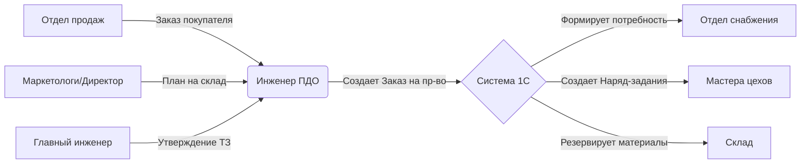

# 🏭 Инструкция: Управление заказами на производство в 1С
**ООО «КБМ» | Версия документа: 1.0 | Дата: 21.03.2026**

| **Ответственные** | Отдел продаж, Инженер ПДО, Главный инженер |
| :--- | :--- |
| **Цель** | Корректное создание заказа на производство на основе потребностей клиентов или плана склада. |
| **Ключевое правило** | ⛔ **Нет заказа на производство = Нет списания материалов, нет зарплаты, нет себестоимости.** |
| **Статус** | ✅ Готов к исполнению |

---

## 1. 🎯 Цель и принципы работы

Данный документ описывает процесс запуска производства в системе. Заказ на производство (Заказ) — это главный управляющий документ, который связывает продажи, снабжение и цеха.

### 🔑 Ключевые принципы
1.  **Производство под заказ:** Создается строго на основании **Заказа покупателя** (результат тендера или прямой продажи).
2.  **Производство на склад:** Создается на основании **Плана производства** (инициатива маркетологов/руководства для заполнения склада ходовой продукцией).
3.  **Единая точка истины:** Все материалы, операции и сроки фиксируются в этом документе. Любые изменения в ходе работы отслеживаются через него.

> 💡 **Контекст для КБМ:**
> *   Если отдел продаж выиграл тендер → Создаем **Заказ покупателя** → На его базе **Заказ на производство**.
> *   Если маркетологи решили сделать партию наконечников «про запас» → Создаем **План производства** → На его базе **Заказ на производство**.

---

## 2. 👥 Схема взаимодействия

### Роли и задачи:
*   **Менеджер по продажам:** Создает и проводит «Заказ покупателя». Контролирует сроки отгрузки.
*   **Главный инженер:** Проверяет техническую возможность, утверждает сложные спецификации.
*   **Инженер ПДО:**
    *   Создает «Заказ на производство».
    *   Проверяет наличие спецификаций.
    *   Устанавливает плановые даты начала и окончания.
    *   Запускает документ в работу.

---

## 3. 🛠 Этап 1: Подготовка (Check-list перед стартом)

Перед созданием заказа убедитесь, что выполнены следующие условия:

### 3.1. Существует основание
*   ✅ Для работы под клиента: Проведен **«Заказ покупателя»** (`Продажи` → `Заказы покупателей`).
*   ✅ Для работы на склад: Утвержден **«План производства»** (`Производство` → `Планирование`).

### 3.2. Готова технологическая база
*   ✅ Для каждой позиции номенклатуры создана **Спецификация** (`НСИ и Администрирование` → `Номенклатура` → вкладка `Спецификации`).
*   ✅ В спецификации заполнен **Состав** (материалы) и **Операции** (трудоемкость).
*   ✅ Спецификация помечена флагом **«Основная»**.

### 3.3. (Опционально) Проверены остатки
Инженер ПДО может предварительно оценить наличие материалов:
*   **Путь:** `Склад и доставка` → `Отчеты` → `Остатки товаров`.

---

## 4. 🚀 Этап 2: Создание заказа на производство

В 1С есть три способа создания документа. Выберите подходящий под вашу ситуацию.

### 🅰️ Способ 1: На основании Заказа покупателя (Рекомендуемый)
*Используется в 90% случаев для работы с реальными клиентами.*

1.  **Откройте Заказ покупателя:**
    *   Перейдите в раздел `Продажи` → `Заказы покупателей`.
    *   Найдите нужный документ (по клиенту или номеру тендера).
2.  **Создайте производственный заказ:**
    *   Нажмите кнопку **Создать на основании** (вверху документа).
    *   Выберите пункт **Заказ на производство**.
3.  **Проверьте автоматическое заполнение:**
    *   Система перенесет Номенклатуру, Количество и Даты из заказа клиента.
    *   Автоматически подтянется **Основная спецификация**.
4.  **Заполните обязательные поля:**
    *   **Срок начала:** Дата планируемого запуска в цех.
    *   **Срок окончания:** Дата готовности к отгрузке (должна быть раньше даты отгрузки клиенту).
    *   **Ответственный:** Инженер ПДО или Главный инженер.
5.  **Заполните материалы:**
    *   Перейдите на вкладку **Материалы**.
    *   Нажмите кнопку **Заполнить** → **Заполнить по спецификации**.
    *   *Проверьте колонку «Обеспечение»:* Система сама подскажет, чего нет на складе (статус «Закупить») и что есть («Из запасов»).
6.  **Проведите документ:**
    *   Нажмите кнопку **Провести**. Статус изменится на «К выполнению».

### 🅱️ Способ 2: На основании Плана производства (На склад)
*Используется для серийной продукции без конкретного клиента.*

1.  Перейдите в `Производство` → `Планирование` → `План производства`.
2.  Откройте утвержденный план.
3.  Нажмите **Создать на основании** → **Заказ на производство**.
4.  Поле «Заказ покупателя» останется пустым. Заполните сроки и проведите документ аналогично Способу 1.

### 🆎 Способ 3: Ручное создание (Инициативное)
*Для опытных образцов, тестовых партий или срочных работ.*

1.  Перейдите в `Производство` → `Заказы на производство`.
2.  Нажмите кнопку **Создать**.
3.  Вручную выберите:
    *   **Номенклатуру** (что производим).
    *   **Количество**.
    *   **Спецификацию** (выберите из списка вручную).
4.  Заполните вкладку **Материалы** кнопкой **Заполнить по спецификации**.
5.  Укажите сроки и проведите документ.

---

## 5. 🔍 Детальный разбор вкладок документа

После создания документа внимательно проверьте три главные вкладки.

### 📦 Вкладка «Материалы»
Здесь формируется потребность для снабженцев.

| Колонка | Описание | Действия |
| :--- | :--- | :--- |
| **Номенклатура** | Список сырья | Заполняется авто-матически. |
| **Плановое кол-во** | Норма × Кол-во изделия | Проверьте соответствие чертежам. |
| **Обеспечение** | Статус наличия | 🔴 **Закупить** (нет на складе)   🟢 **Из запасов** (есть на складе)   🟡 **Часть запасов** (хватает частично) |
| **Склад** | Откуда брать | Если статус «Из запасов», укажите конкретный склад. |

> ⚠️ **Внимание:** Если колонка «Обеспечение» показывает «Закупить», обязательно передайте информацию снабженцу! Без этого материал не придет в цех.

### ⚙️ Вкладка «Операции»
Здесь планируется загрузка цехов и расчет зарплаты.

| Колонка | Описание | Действия |
| :--- | :--- | :--- |
| **Операция** | Этап (Токарная, Сборка) | Из спецификации. |
| **Подразделение** | Цех-исполнитель | Убедитесь, что выбран верный цех (Токарный/Сборочный). |
| **Норма времени** | Плановые часы | Нужно для расчета мощности и зарплаты. |
| **Сроки операции** | Начало/Конец этапа | Можно сдвинуть относительно общих сроков заказа. |

### 📋 Вкладка «Дополнительно»
*   **Приоритет:** Установите «Высокий» для срочных тендерных заказов. Это повлияет на приоритет обеспечения материалами.
*   **Комментарий:** Внутренние заметки для мастеров (например, «Использовать партию стали №123»).

---

## 6. ⚡ Что происходит после проведения?

Как только вы нажали кнопку **Провести**, в системе автоматически запускаются процессы:

1.  **Формирование потребности:**
    *   Данные попадают в отчет `Расчет потребностей` (`Закупки` → `Планирование`). Снабженец видит, что нужно купить.
2.  **Резервирование (если включено):**
    *   Материалы, которые есть на складе, резервируются именно под этот заказ. Другие заказы не смогут их забрать.
3.  **Создание Наряд-заданий (опционально):**
    *   Если в настройках указано автосоздание, для каждого цеха генерируется документ `Наряд-задание`, который увидит Мастер цеха.

---

## 7. 📊 Контроль исполнения

Как отслеживать статус заказа?

### 7.1. Монитор заказов
**Путь:** `Производство` → `Заказы на производство`
Обратите внимание на столбец **Статус**:
*   🟡 **К выполнению:** Документ проведен, но производство еще не началось (или материалы не выданы).
*   🟠 **В работе:** Материалы частично списаны, идут отчеты производства.
*   🟢 **Выполнен:** Продукция выпущена и оприходована на склад.
*   ⚪ **Закрыт:** Все документы закрыты, себестоимость рассчитана.

### 7.2. Отчет «Выпуск продукции по заказам»
**Путь:** `Производство` → `Отчеты` → `Выпуск продукции по заказам`
Показывает прогресс: сколько планировали vs сколько сделали фактически.

### 7.3. Отчет «Незавершенное производство (НЗП)»
**Порт:** `Производство` → `Отчеты` → `Незавершенное производство`
Показывает, какие материалы уже «зависли» в цеху по этому заказу, но еще не стали готовым изделием.

---

## 8. ⛔ Типичные ошибки и решения

| Ошибка | Последствие | Как предотвратить |
| :--- | :--- | :--- |
| **Нет спецификации** | Вкладка «Материалы» пустая. Потребность не считается. | Создать спецификацию **до** создания заказа. |
| **Забыли нажать «Заполнить по спецификации»** | В документе пусто, снабженец не видит потребность. | Всегда проверяйте вкладку «Материалы» после создания. |
| **Не указан срок окончания** | Невозможно построить план загрузки цехов. | Заполнять даты обязательно. |
| **Неверная спецификация** | Списали не тот металл или не те нормы. | Проверять, какая спецификация стоит «Основной» в карточке товара. |
| **Заказ не проведен** | Система считает его черновиком. Никаких движений нет. | Проверять галочку проведения вверху документа. |

---

## 9. ✅ Чек-лист перед запуском в работу

Перед тем как сказать «Запускаем», проверьте:

- [ ] Основание есть (Заказ покупателя или План).
- [ ] Спецификация создана и активна.
- [ ] Вкладка «Материалы» заполнена (не пуста!).
- [ ] Статус обеспечения проверен (понятно, что закупать, а что брать со склада).
- [ ] Сроки начала и окончания указаны реалистично.
- [ ] Документ проведен (статус «К выполнению»).
- [ ] Снабженец уведомлен о потребности (через отчет «Расчет потребностей»).

---

## 10. ➡️ Следующие шаги

После создания заказа на производство эстафета переходит к другим отделам:

1.  **Отдел снабжения:** Формирует `Заказы поставщикам` на основе возникшей потребности.
2.  **Склад:** Подготавливает материалы к выдаче (резерв).
3.  **Мастера цехов:** Получают `Наряд-задания` и начинают работу.

---
*Документ разработан для внутреннего использования ООО «КБМ». Копирование без согласования запрещено.*