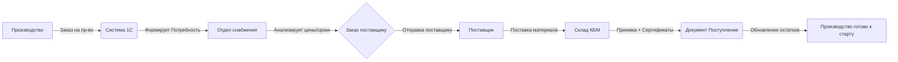

# 🚚 Инструкция: Закупки и поступление материалов в 1С:УНФ
**ООО «КБМ» | Версия документа: 1.0 | Дата: 21.03.2026**

| **Ответственные** | Отдел снабжения, Кладовщик, Экономист |
| :--- | :--- |
| **Цель** | Организация бесперебойного обеспечения производства материалами по принципу «Точно в срок». |
| **Ключевое правило** | ⛔ **Нет потребности в системе = Нет заказа поставщику.** Закупки «на глаз» запрещены. |
| **Статус** | ✅ Готов к исполнению |

---

## 1. 🎯 Цель и принципы работы

Данный документ регламентирует процесс закупок: от момента, когда система сказала «нужно купить», до момента оприходования металла на склад.

### 🔑 Ключевые принципы
1.  **Плановость:** Все закупки инициируются автоматически на основании **Заказов на производство** (или плана продаж).
2.  **Документальная цепочка:** `Потребность` → `Заказ поставщику` → `Поступление`. Разрыв цепочки ведет к потере контроля.
3.  **Актуальность цен:** Каждая закупка обновляет историю цен для корректного расчета себестоимости будущих изделий.
4.  **Фактический приход:** Оприходование производится только после физической приемки товара на складе.

> 💡 **Контекст для КБМ:**
> Для производства буровых наконечников критичны сроки поставки специфических марок стали (40Х, 09Г2С). Система поможет заранее увидеть дефицит и заказать металл до остановки цеха.

---

## 2. 👥 Схема взаимодействия

### Роли и задачи:
*   **Инженер ПДО / Экономист:** Контролируют отчет «Потребности», подтверждают необходимость закупки.
*   **Менеджер по закупкам (Снабженец):**
    *   Выбирает поставщика (цена/срок/качество).
    *   Создает и отправляет `Заказ поставщику`.
    *   Контролирует исполнение сроков.
*   **Кладовщик:**
    *   Принимает груз, проверяет количество и качество.
    *   Загружает сканы сертификатов в систему.
    *   Оформляет `Поступление товаров и услуг`.

---

## 3. 📉 Этап 1: Формирование потребности

Прежде чем звонить поставщику, нужно понять, чего именно не хватает.

### 3.1. Отчет «Потребности в запасах»
**Путь:** `Закупки` → `Планирование` → `Потребности в запасах` (или `Расчет потребностей`).

Этот отчет показывает разницу между тем, что нужно для производства, и тем, что есть на складе.

| Номенклатура | Нужно для заказов | Есть на складе | **Нужно купить** | Срок потребности |
| :--- | :---: | :---: | :---: | :--- |
| Сталь 40Х (круг) | 500 кг | 200 кг | **300 кг** | 25.03.2026 |
| Электроды УОНИ | 50 кг | 60 кг | **0 кг** | - |

> ✅ **Действие:** Снабженец фильтрует отчет по срокам (например, «на ближайшие 2 недели») и видит список того, что срочно нужно заказать.

### 3.2. Выбор поставщика и проверка цен
**Путь:** `Закупки` → `Цены поставщиков` → `История цен`.
*   Проверьте, у кого последний раз покупали эту позицию и по какой цене.
*   Учтите сроки доставки (у разных поставщиков они могут отличаться).

---

## 4. 📝 Этап 2: Оформление заказа поставщику

Есть три способа создания заказа. Используйте рекомендуемый.

### 🅰️ Способ 1: Из отчета потребностей (Рекомендуемый)
*Гарантирует, что вы закупаете только то, что реально нужно производству.*

1.  В отчете «Потребности в запасах» выделите нужные строки (галочками).
2.  Нажмите кнопку **Оформить заказ** (или `Создать на основании` → `Заказ поставщику`).
3.  Система создаст документ, сгруппировав товары по поставщикам (если выбраны разные).
4.  **Заполните шапку документа:**
    *   **Контрагент:** Выберите поставщика.
    *   **Договор:** Проверьте тип договора («С поставщиком»).
    *   **Срок поставки:** Укажите реальную дату прибытия груза (важно для планирования цеха!).
    *   **Склад:** Укажите, на какой склад придет товар (обычно `Склад сырья`).
5.  **Проверьте табличную часть:**
    *   Убедитесь, что **Цена** заполнена. Если нет — введите согласованную цену.
6.  **Проведите документ.** Статус изменится на «К выполнению».

### 🅱️ Способ 2: Из Заказа на производство
*Если нужно срочно докупить материал под конкретный срочный заказ.*

1.  Откройте `Заказ на производство`.
2.  Перейдите на вкладку **Материалы**.
3.  Найдите строки со статусом обеспечения 🔴 **Закупить**.
4.  Выделите их и нажмите **Создать заказы поставщикам**.
5.  Заполните данные поставщика и проведите документ.

### 🆎 Способ 3: Ручное создание
*Только для хознужд, инструмента или материалов, не введенных в спецификации.*

1.  `Закупки` → `Заказы поставщикам` → `Создать`.
2.  Вручную добавьте товары, укажите цены и сроки.
3.  Проведите.

> ⚠️ **Важно:** После проведения заказа он попадает в список ожидаемых поставок. Производство видит, что материал «в пути».

---

## 5. 📦 Этап 3: Поступление материалов на склад

Когда грузовик приехал, начинается работа кладовщика.

### 5.1. Оформление приходной накладной
**Критично:** Создавайте документ строго на основании заказа, чтобы система автоматически закрыла потребность.

1.  Откройте проведенный `Заказ поставщику` (`Закупки` → `Заказы поставщикам`).
2.  Нажмите кнопку **Создать на основании** → **Поступление товаров и услуг**.
3.  **Проверка данных:**
    *   Система перенесет номенклатуру, цены и суммы из заказа.
    *   **Дата документа:** Текущая дата фактического приема.
4.  **Корректировка фактического количества:**
    *   ✅ **Пришло точно:** Ничего не меняйте.
    *   ⚠️ **Недовоз:** Уменьшите количество в строке до фактического. Остаток заказа останется висеть как «к оплате».
    *   ⚠️ **Пересорт/Лишнее:** Добавьте новую строку вручную или измените количество (система предупредит о превышении заказа).
5.  **Загрузка сертификатов:**
    *   Внизу формы есть поле «Файлы» или кнопка `Присоединить файлы`.
    *   Прикрепите сканы сертификатов качества на металл (обязательно для ОТК!).
6.  **Проведение:**
    *   Нажмите **Провести и закрыть**.
    *   Остатки на складе мгновенно увеличатся.

### 5.2. Особенности ордерной схемы (если включена)
Если у вас настроены ордерные склады (разделение зоны разгрузки и зоны хранения):
1.  После проведения «Поступления» создается **Приходный ордер**.
2.  Кладовщик должен открыть ордер (`Склад` → `Складские ордера`), отсканировать/пересчитать товар и нажать **Разместить**.
3.  Только после этого товар становится доступен для отгрузки в цех.

---

## 6. 💰 Регистрация цен поставщиков

Чтобы система «помнила» цены и помогала планировать бюджет:

1.  В документе «Поступление товаров и услуг» убедитесь, что цены актуальны.
2.  Нажмите кнопку **Еще** → **Зарегистрировать цены поставщиков** (или соответствующую галочку при проведении, если настроено).
3.  Теперь при следующем создании заказа эта цена подставится автоматически.

**Проверка истории:**
`Закупки` → `Цены поставщиков` → отчет `История изменений цен`.

---

## 7. 📊 Контроль исполнения

Как снабженцу не забыть про заказы?

### 7.1. Журнал заказов
**Путь:** `Закупки` → `Заказы поставщикам`.
Обратите внимание на колонку **Статус**:
*   🟡 **К выполнению:** Ждем поставку.
*   🟢 **Выполнен:** Товар пришел, заказ закрыт.
*   🔴 **Просрочен:** Дата поставки прошла, а товара нет (система подсветит красным).

### 7.2. Отчет «Поставки от поставщиков»
**Путь:** `Закупки` → `Отчеты` → `Поставки от поставщиков`.
Показывает сводку: Заказано vs Получено. Удобно для ежемесячного анализа работы поставщиков.

---

## 8. ⛔ Типичные ошибки и решения

| Ошибка | Последствие | Как предотвратить |
| :--- | :--- | :--- |
| **Закупка без потребности** | Затovarивание склада, заморозка денег. | Всегда начинать с отчета «Потребности». |
| **Приход без ссылки на Заказ** | Заказ остается висеть как «незакрытый», потребность не снимается. | Всегда использовать кнопку **«Создать на основании»**. |
| **Нет цены в документе** | Себестоимость продукции будет нулевой или рассчитается неверно. | Проверять поле «Цена» перед проведением. |
| **Не указан склад** | Товар «повис» в пути, цех не видит его в остатках. | Обязательно выбирать склад в шапке или строках. |
| **Сертификаты не прикреплены** | ОТК не может принять металл в работу, простой цеха. | Сделать прикрепление файлов обязательным правилом для кладовщика. |

---

## 9. ✅ Чек-лист снабженца и кладовщика

Перед тем как считать закупку завершенной:

- [ ] Потребность проверена в отчете «Потребности в запасах».
- [ ] Выбран поставщик с лучшей ценой и сроком.
- [ ] `Заказ поставщику` создан, проведен и отправлен.
- [ ] Товар физически прибыл на склад.
- [ ] Количество и качество сверены с накладной поставщика.
- [ ] Сканы сертификатов загружены в базу.
- [ ] `Поступление товаров и услуг` создано **из Заказа** и проведено.
- [ ] Цены обновлены в регистре сведений.
- [ ] Остатки в отчете «Остатки товаров» увеличились.

---

## 10. ➡️ Следующие шаги

Материалы на складе! Теперь эстафета переходит в цех.

1.  **Мастер цеха:** Формирует `Требование-накладную` для получения металла со склада.
2.  **Кладовщик:** Отпускает материал по требованию.
3.  **Производство:** Запускает станки и фиксирует выработку.

---
*Документ разработан для внутреннего использования ООО «КБМ». Копирование без согласования запрещено.*