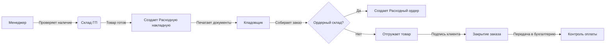

# 🚚 Инструкция: Отгрузка готовой продукции клиенту (1С:УНФ)
**ООО «КБМ» | Версия: 1.0 | Дата: 21.03.2026**

| **Ответственные** | Менеджер по продажам, Кладовщик, Бухгалтер |
| :--- | :--- |
| **Цель** | Корректное оформление передачи готовой продукции клиенту, формирование выручки и документов для покупателя. |
| **Ключевое правило** | ⛔ **Нет товара на складе ГП = Нет отгрузки.** Продукция должна пройти ОТК и быть оприходована на склад готовой продукции. |
| **Статус** | ✅ Готов к исполнению |

---

## 1. 🎯 Цель и принципы работы

Данный документ регламентирует финальный этап цикла продаж — передачу товара покупателю. От точности оформления зависит своевременность получения денег и правильность учета НДС.

### 🔑 Ключевые принципы
1.  **Строгая привязка к заказу:** Отгрузка производится строго на основании подтвержденного `Заказа покупателя`.
2.  **Контроль остатков:** Система не даст отгрузить то, чего нет на складе (или то, что не прошло ОТК).
3.  **Документальная цепочка:** `Заказ` → `Расходная накладная` → `Транспортная накладная/Ордер` → `Счет-фактура/УПД`.
4.  **Финансовый результат:** В момент отгрузки формируется выручка и списывается себестоимость.

> 💡 **Контекст для КБМ:**
> Буровые наконечники — продукция специфическая. Важно убедиться, что отгружается именно та партия, которая прошла контроль качества и имеет сертификаты (серии/партии).

---

## 2. 👥 Схема взаимодействия

### Роли и задачи:
*   **Менеджер по продажам:**
    *   Проверяет готовность товара.
    *   Создает `Расходную накладную`.
    *   Формирует пакет документов для клиента (УПД, ТОРГ-12, Счет-фактура).
*   **Кладовщик:**
    *   Видит задание на отгрузку.
    *   Если включены ордеры: создает `Расходный ордер`, комплектует груз.
    *   Передает товар водителю/клиенту.
*   **Бухгалтер:**
    *   Контролирует поступление оплаты.
    *   Сверяет взаиморасчеты.

---

## 3. 🛠 Этап 1: Подготовка к отгрузке

Перед созданием документов убедитесь, что все условия выполнены.

### 3.1. Проверка наличия товара
**Путь:** `Склад и доставка` → `Отчеты` → `Остатки товаров`.
*   Выберите склад: **`Склад готовой продукции`**.
*   ⚠️ **Важно:** Если товар числится на `Складе ОТК`, отгружать его **нельзя**! Сначала контролер должен перевести его на склад ГП.
*   Проверьте наличие нужного количества и серий (если ведете учет по сериям).

### 3.2. Проверка статуса заказа
**Путь:** `Продажи` → `Заказы покупателей`.
*   Найдите заказ клиента.
*   Статус должен быть **«К отгрузке»** или **«В работе»**.
*   Убедитесь, что заказ не закрыт и не отгружен ранее полностью.

### 3.3. Контроль оплаты (опционально)
Если у вас действует правило «Отгрузка только после оплаты»:
*   Проверьте отчет `Взаиморасчеты с покупателями`.
*   Убедитесь, что долг погашен или есть разрешение руководителя на отгрузку в долг.

---

## 4. 📝 Этап 2: Оформление отгрузки

Основной документ — **`Расходная накладная`**.

### 🅰️ Способ 1: На основании Заказа покупателя (Рекомендуемый)
Гарантирует, что цены и номенклатура соответствуют договоренностям.

1.  Откройте `Заказ покупателя`.
2.  Нажмите кнопку **Создать на основании** → **Расходная накладная**.
3.  **Проверка данных:**
    *   Система перенесет товары, количества и цены.
    *   **Склад:** Убедитесь, что указан `Склад готовой продукции`.
4.  **Частичная отгрузка:**
    *   Если отгружаете не всё количество, просто измените цифру в колонке «Количество» в накладной. Остаток сохранится в заказе для следующей отгрузки.
5.  **Резервирование:**
    *   Если товар был зарезервирован ранее, система автоматически снимет резерв под эту накладную.
6.  **Проведение:**
    *   Нажмите **Провести и закрыть**.
    *   ✅ Товар списан со склада.
    *   ✅ Сформирована дебиторская задолженность (если не оплачено).
    *   ✅ Списана себестоимость (видимо только бухгалтеру/экономисту).

### 🅱️ Способ 2: Ручное создание
Используется только для разовых продаж без предварительного заказа (не рекомендуется для постоянных клиентов).

1.  `Продажи` → `Расходные накладные` → `Создать`.
2.  Вручную выберите Контрагента, Договор, Склад и добавьте Товары.
3.  Проведите документ.

---

## 5. 📦 Этап 3: Работа на складе (Ордерная схема)

Если у вас настроена **ордерная схема** (разделение зоны хранения и зоны отгрузки):

1.  После проведения `Расходной накладной` создается задание на отгрузку.
2.  Кладовщик переходит в раздел `Склад и доставка` → `Складские ордера`.
3.  Находит ордер со статусом «К отгрузке».
4.  Комплектует товар, сканирует ячейки (если есть адресное хранение).
5.  Нажимает **Разместить** (или **Отгрузить**).
6.  Только после этого товар считается физически покинувшим склад.

> ⚠️ **Внимание:** Если ордерная схема **не** включена, то проведение `Расходной накладной` сразу уменьшает остатки, и кладовщик просто выдает товар по факту.

---

## 6. 🖨 Этап 4: Печатные документы

Для клиента необходимо сформировать пакет документов.

**Путь:** В открытой `Расходной накладной` нажмите кнопку **Печать** (или «Еще» → «Печать»).

Выберите нужные формы:
*   📄 **УПД (Универсальный передаточный документ):** Самый популярный вариант. Заменяет накладную и счет-фактуру. Статус «1» (счет-фактура + передаточный) или «2» (только передаточный).
*   📄 **ТОРГ-12:** Товарная накладная (классический вариант).
*   📄 **Счет-фактура:** Если работаете с НДС и не используете УПД.
*   📄 **ТТН (Товарно-транспортная накладная):** Если доставку осуществляете своим транспортом или через перевозчика с участием водителя.

> 💡 **Совет:** Сразу сформируйте 2 экземпляра для подписи у клиента. Один забирает клиент, второй возвращается вам.

---

## 7. ↩️ Возврат от клиента

Если клиент вернул товар (брак, пересорт, отказ):

**Документ:** `Возврат товаров от покупателя`
**Путь:** `Продажи` → `Возвраты товаров от покупателей` → `Создать`.

1.  **Основание:** Лучше создать **на основании** той `Расходной накладной`, по которой была отгрузка. Тогда цены и номенклатура подтянутся автоматически.
2.  **Тип операции:**
    *   «Возврат от клиента» (товар принят обратно на склад).
    *   «Возврат поставщику» (если это технически возврат поставщику, но в контексте продаж обычно первый вариант).
3.  **Склад:** Укажите `Склад готовой продукции` (или `Склад брака`, если товар поврежден).
4.  **Проведение:**
    *   Товар оприходуется на склад.
    *   Уменьшится долг клиента (или возникнет долг предприятия перед клиентом).
    *   Скорректируется выручка и себестоимость (сторнирование).

---

## 8. 📊 Контроль и отчеты

### 8.1. Реализация продукции
**Путь:** `Продажи` → `Отчеты` → `Реализация продукции`.
*   Сколько и кому отгружено за период.
*   Выручка в разрезе менеджеров или товаров.

### 8.2. Валовая прибыль по заказам
**Путь:** `Продажи` → `Отчеты` → `Валовая прибыль`.
*   **Критически важный отчет!** Показывает разницу между ценой продажи и себестоимостью.
*   Позволяет понять, насколько выгоден был конкретный заказ.

### 8.3. Взаиморасчеты с покупателями
**Путь:** `Продажи` → `Отчеты` → `Взаиморасчеты с покупателями`.
*   Кто сколько должен.
*   Есть ли просроченная дебиторская задолженность.

---

## 9. ⛔ Типичные ошибки и решения

| Ошибка | Последствие | Как предотвратить |
| :--- | :--- | :--- |
| **Отгрузка без проверки ОТК** | Клиент получил брак (товар ушел со склада ОТК или "виртуально"). | Проверяйте отчет по остаткам: товар должен быть на **Складе ГП**. |
| **Не указан склад в накладной** | Товар не списался, остатки "повисли". | Всегда проверяйте поле **Склад** в шапке документа. |
| **Цена отличается от заказа** | Конфликт с клиентом, искажение прибыли. | Создавайте накладную **строго из Заказа покупателя**. |
| **Заказ не закрыт после отгрузки** | Менеджер видит заказ как "активный", планирует повторную отгрузку. | После полной отгрузки статус заказа должен стать **«Выполнен»**. |
| **Возврат оформлен без оприходования** | Товар физически вернулся, но в системе его нет (потеря). | Убедитесь, что документ возврата **проведен** и указан склад приема. |

---

## 10. ✅ Чек-лист отгрузки

- [ ] Товар прошел ОТК и лежит на `Складе готовой продукции`.
- [ ] Заказ покупателя найден и проверен.
- [ ] `Расходная накладная` создана на основании заказа.
- [ ] Количество и цены соответствуют договору.
- [ ] Документ проведен (остатки уменьшились).
- [ ] Сформированы печатные формы (УПД/ТОРГ-12).
- [ ] Товар передан клиенту (подписанные экземпляры получены).
- [ ] Заказ закрыт (если отгружено полностью).
- [ ] Копия накладной передана бухгалтеру для контроля оплаты.

---

## 11. ➡️ Следующие шаги

Отгрузка произведена. Цикл продаж завершен, начинается финансовый цикл.

1.  **Менеджер:** Контролирует получение подписанных документов от клиента и оплату счета.
2.  **Бухгалтер:** Отражает поступление денег, закрывает взаиморасчеты.
3.  **Экономист:** Анализирует маржинальность сделки в отчете «Валовая прибыль».
4.  **В конце месяца:** Проводится процедура закрытия месяца для окончательного расчета финансового результата.

Следующий документ инструкции:
📄 **`11_month_end.md`** — *«Закрытие месяца: расчет себестоимости, финансовых результатов и регламентные операции»*.

---
*Документ разработан для внутреннего использования ООО «КБМ». Копирование без согласования запрещено.*