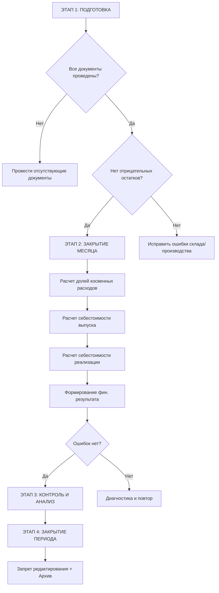

# 📅 Инструкция: Регламент закрытия месяца в 1С:УНФ
**ООО «КБМ» | Версия: 1.0 | Дата: 21.03.2026**

| **Ответственные** | Главный бухгалтер, Экономист, Главный инженер |
| :--- | :--- |
| **Цель** | Корректное завершение операционного периода, расчет фактической себестоимости и финансового результата. |
| **Ключевое правило** | ⛔ **Стоп-кран:** После успешного закрытия месяца внесение изменений в документы этого периода запрещено без отмены процедуры закрытия. |
| **Статус** | ✅ Готов к исполнению |

---

## 1. 🎯 Цель и принципы работы

Закрытие месяца — это не одна кнопка, а комплекс регламентных операций, которые переводят накопленные за месяц данные (выработку, закупки, продажи) в финансовые показатели (прибыль, убыток, себестоимость).

### 🔑 Ключевые принципы
1.  **Хронологическая строгость:** Операции выполняются строго в заданном порядке. Нельзя рассчитать прибыль, не закрыв производство.
2.  **Полнота данных:** Закрытие возможно только после проведения *всех* первичных документов за период.
3.  **Контроль остатков:** Отрицательные остатки товаров или материалов блокируют корректный расчет себестоимости.
4.  **Фиксация результата:** После закрытия данные считаются окончательными для управленческой и налоговой отчетности.

> 💡 **Контекст для КБМ:**
> Для производственного предприятия критично правильно закрыть незавершенное производство (НЗП). Если цех не сдал отчеты или кладовщик не провел накладные, себестоимость выпущенных наконечников будет искажена.

---

## 2. 🔄 Общая схема процесса

Процесс делится на четыре последовательных этапа:

---

## 3. 🛠 Этап 1: Подготовка к закрытию месяца

*Самый важный этап. 90% ошибок при закрытии происходят из-за пропуска этих шагов.*

### 3.1. Проверка закрытия всех документов
Необходимо убедиться, что все хозяйственные операции отражены в системе.

| Раздел | Документ | Что проверить |
| :--- | :--- | :--- |
| **Закупки** | Поступление товаров и услуг | Все проведены |
| **Закупки** | Заказы поставщикам | Все проведены или закрыты |
| **Продажи** | Расходные накладные | Все проведены |
| **Продажи** | Заказы покупателей | Все проведены или закрыты |
| **Склад** | Требования-накладные | Все проведены (выдача в цех) |
| **Склад** | Перемещения товаров | Все проведены (между цехами) |
| **Производство** | Отчеты производства за смену | Все проведены (выпуск продукции) |
| **Производство** | Сдельные наряды | Все закрыты (для зарплаты) |
| **Производство** | Заказы на производство | Выполненные заказы закрыты |
| **Персонал** | Начисление зарплаты | Проведен за текущий месяц |

**Как проверить массово:**
`Администрирование` → `Журнал регистрации`. Установите отбор по дате (последний день месяца) и убедитесь, что нет документов со статусом «Не проведен».

### 3.2. Проверка отсутствия отрицательных остатков
**Путь:** `Склад и доставка` → `Отчеты` → `Остатки товаров`.
*   Установите период: последний день месяца.
*   Выберите все склады.
*   ⛔ **Критично:** В отчете не должно быть отрицательных количеств или сумм.
    *   *Если есть минус:* Найдите документ, который ушел «вперед» поступления (например, списали материал, который еще не оприходовали), и исправьте хронологию.

### 3.3. Проверка закрытия заказов на производство
**Путь:** `Производство` → `Заказы на производство`.
*   Отфильтруйте заказы со статусом **«В работе»** за закрываемый месяц.
*   Если продукция фактически выпущена, но заказ висит открытым — закройте его вручную (кнопка **«Закрыть»**), чтобы затраты корректно списались.

### 3.4. Ввод фактических косвенных расходов
Все накладные расходы должны быть явно введены в систему до запуска процедуры закрытия.

**Путь:** `Финансовый результат и контроллинг` → `Ввод косвенных расходов` → `Создать`.

| Статья затрат | Сумма | Подразделение | Комментарий |
| :--- | :--- | :--- | :--- |
| Аренда склада | 100 000 ₽ | Общепроизводственные | По договору аренды |
| Аренда офиса | 80 000 ₽ | Общехозяйственные | По договору аренды |
| Зарплата АУП | 200 000 ₽ | Общехозяйственные | Начислено в зарплате |
| Амортизация | 50 000 ₽ | Общепроизводственные | Расчет бухгалтера |
| Электроэнергия | 30 000 ₽ | Общепроизводственные | Счет от поставщика |
| Связь, интернет | 10 000 ₽ | Общехозяйственные | Счет от провайдера |

> ⚠️ **Важно:** Если расход относится к конкретному цеху, обязательно укажите это подразделение для точного распределения затрат.

### 3.5. Сверка с бухгалтерией (если настроена синхронизация)
Если ведется обмен с 1С:Бухгалтерией:
1.  Выполните синхронизацию: `Настройки` → `Синхронизация данных` → `Синхронизировать`.
2.  Сверьте ключевые обороты (Выручка, Поступления материалов) в двух базах. Расхождений быть не должно.

---

## 4. ⚙️ Этап 2: Выполнение закрытия месяца

### 4.1. Запуск процедуры
**Путь:** `Финансовый результат и контроллинг` → `Закрытие месяца`.
1.  Выберите год и месяц.
2.  Нажмите кнопку **Выполнить закрытие месяца**.

### 4.2. Последовательность операций
Система автоматически выполнит 4 ключевых шага. Следите за индикаторами статуса:
*   🟢 **Выполнено** — успех.
*   🟡 **Выполнено с замечаниями** — требует внимания (но не блокирует).
*   🔴 **Ошибка** — блокирует процесс, требует исправления.

| № | Операция | Назначение |
| :--- | :--- | :--- |
| **1** | **Расчет долей списания косвенных расходов** | Определение базы распределения (прямые затраты, нормо-часы) для переноса косвенных расходов на производство. |
| **2** | **Расчет себестоимости выпуска** | Формирование полной стоимости произведенной продукции (Материалы + ЗП + Накладные). |
| **3** | **Расчет себестоимости реализации** | Списание стоимости отгруженных товаров в расходы текущего периода. |
| **4** | **Формирование финансового результата** | Сопоставление доходов и расходов, расчет прибыли или убытка. |

### 4.3. Действия при ошибках
Если шаг подсветился красным:
1.  Раскройте ветку операции, чтобы прочитать текст ошибки.
2.  Чаще всего причины: «Отрицательные остатки», «Не заполнена статья затрат», «Нет спецификации».
3.  Исправьте исходные данные (проведите документы, заполните справочники).
4.  Нажмите **Выполнить закрытие месяца** заново (система продолжит с места остановки или пересчитает всё).

---

## 5. 📊 Этап 3: Контроль и анализ результатов

После успешного выполнения (все зеленое) необходимо проанализировать цифры.

### 5.1. Проверка себестоимости продукции
**Путь:** `Финансы` → `Отчеты` → `Себестоимость продукции`.

| Номенклатура | Кол-во | Материалы | Зарплата | Косвенные | Итого с/с | Цена продажи | Прибыль |
| :--- | :---: | :---: | :---: | :---: | :---: | :---: | :---: |
| НБ-120 | 10 шт | 62 000 | 15 500 | 11 500 | **89 000** | 250 000 | 161 000 |
| НБ-150 | 5 шт | 45 000 | 8 000 | 7 500 | **60 500** | 150 000 | 89 500 |

**Что проверить:**
*   [ ] Себестоимость положительная и не нулевая.
*   [ ] Структура затрат выглядит реалистично (нет аномальных всплесков).

### 5.2. Анализ отклонений План-Факт
**Путь:** `Финансы` → `Отчеты` → `План-факт анализ себестоимости`.

| Номенклатура | План | Факт | Отклонение | % | Причина |
| :--- | :---: | :---: | :---: | :---: | :--- |
| НБ-120 | 86 250 | 89 000 | +2 750 | +3.2% | Перерасход металла |

**Рекомендации по реакциям:**
*   🟢 **До 5%:** Допустимое колебание. Принять к сведению.
*   🟡 **5–15%:** Требуется разбор причин с технологом/мастером. Возможно, нужно обновить нормы.
*   🔴 **>15%:** Критическое отклонение. Требует служебного расследования и корректировки процессов.

### 5.3. Проверка распределения косвенных расходов
**Путь:** `Финансы` → `Отчеты` → `Распределение косвенных расходов`.
Убедитесь, что вся сумма введенных косвенных расходов (аренда, свет, АУП) полностью распределилась на продукцию и не осталась «висеть» на счетах затрат.

### 5.4. Итоговый финансовый результат
**Путь:** `Финансы` → `Отчеты` → `Доходы и расходы`.

| Показатель | Сумма |
| :--- | :---: |
| **Доходы (Выручка)** | **400 000 ₽** |
| *Минус Себестоимость продаж* | -149 500 ₽ |
| *Минус Косвенные расходы* | -350 000 ₽ |
| **Финансовый результат (Прибыль/Убыток)** | **-99 500 ₽** |

> 📉 **Анализ убытка:** В примере выше видно, что валовой прибыли (250 500 ₽) не хватило для покрытия постоянных расходов (350 000 ₽). Это сигнал к увеличению объема продаж или сокращению управленческих затрат.

---

## 6. 🔒 Этап 4: Закрытие периода

### 6.1. Установка запрета редактирования
Чтобы защитить данные от случайных изменений задним числом:
**Путь:** `Администрирование` → `Настройка пользователей и прав` → `Дата запрета редактирования`.
*   Установите дату: **1-е число следующего месяца** (например, 01.04.2026).
*   Разрешение на изменение оставьте только для роли «Главный бухгалтер» или «Администратор».

> ⚠️ **Если нужно исправить ошибку прошлого месяца:**
> 1. Временно снимите запрет.
> 2. Внесите исправления.
> 3. **Обязательно** перезапустите процедуру «Закрытие месяца».
> 4. Снова установите запрет.

### 6.2. Передача данных в бухгалтерию
*   **При синхронизации:** Выполните финальный обмен (`Настройки` → `Синхронизация данных`).
*   **Без синхронизации:** Экспортируйте отчеты «Доходы и расходы», «Себестоимость продукции» и «Оборотно-сальдовая ведомость» в Excel и передайте бухгалтеру для ввода в 1С:Бухгалтерию.

### 6.3. Архивирование отчетов
Сохраните в отдельную папку (PDF/Excel) ключевые отчеты месяца:
1.  Себестоимость продукции.
2.  Доходы и расходы.
3.  Валовая прибыль по заказам.
4.  Остатки товаров и НЗП на конец месяца.

---

## 7. 📅 Календарный график закрытия (Чек-лист)

| Дата | Действие | Ответственный |
| :--- | :--- | :--- |
| **25-е число** | Напоминание о приближении закрытия | Экономист |
| **Последний рабочий день** | Завершение ввода всех первичных документов | Все сотрудники |
| **1-й день месяца** | Проверка непроведенных документов и минусовых остатков | Экономист |
| **1-й день месяца** | Ввод косвенных расходов (аренда, свет и т.д.) | Бухгалтер |
| **2-й день месяца** | Выполнение процедуры «Закрытие месяца» | Экономист |
| **2-й день месяца** | Анализ себестоимости и отклонений План-Факт | Экономист |
| **3-й день месяца** | Формирование отчета для руководства | Экономист |
| **3-й день месяца** | Установка даты запрета редактирования | Администратор |
| **4-й день месяца** | Финальная синхронизация с 1С:Бухгалтерией | Администратор |

---

## 8. ⛔ Типичные ошибки и их устранение

| Ошибка | Причина | Решение |
| :--- | :--- | :--- |
| **Отрицательные остатки** | Документы проведены не в хронологическом порядке (списание раньше прихода). | Найти товар с минусом, найти документ списания, перепровести поступление более ранней датой. |
| **Нулевая себестоимость** | Не указаны цены в приходных накладных или нет спецификаций. | Заполнить цены в документах поступления, проверить наличие спецификаций у номенклатуры. |
| **Косвенные расходы не распределились** | Не введен документ «Ввод косвенных расходов» или не указана база распределения. | Ввести расходы, проверить настройки статей затрат. |
| **Зависшие заказы на производство** | Заказ выполнен, но статус не изменен. | Открыть заказ, нажать кнопку «Закрыть». |
| **Ошибка «Не рассчитана себестоимость выпуска»** | Отсутствие отчетов производства за смену. | Провести все отчеты производства за месяц. |

---

## 9. ✅ Итоговый чек-лист готовности

| № | Действие | Статус | Ответственный |
| :--- | :--- | :---: | :--- |
| **Подготовка** | | | |
| 1 | Все документы за месяц проведены | ⬜ | Экономист |
| 2 | Отрицательные остатки устранены | ⬜ | Экономист |
| 3 | Все заказы на производство закрыты | ⬜ | Инженер ПДО |
| 4 | Косвенные расходы введены | ⬜ | Бухгалтер |
| 5 | Синхронизация с БП выполнена (предварительно) | ⬜ | Администратор |
| **Закрытие** | | | |
| 6 | Процедура «Закрытие месяца» выполнена без ошибок | ⬜ | Экономист |
| **Контроль** | | | |
| 7 | Себестоимость проверена (нет нулей и минусов) | ⬜ | Экономист |
| 8 | Проведен анализ отклонений План-Факт | ⬜ | Экономист |
| 9 | Финансовый результат сформирован | ⬜ | Экономист |
| **Завершение** | | | |
| 10 | Дата запрета редактирования установлена | ⬜ | Администратор |
| 11 | Данные переданы в бухгалтерию | ⬜ | Экономист |
| 12 | Отчеты сохранены в архив | ⬜ | Экономист |

---

## 10. 📎 Приложение: Быстрые ссылки

| Действие | Путь в меню |
| :--- | :--- |
| Выполнить закрытие месяца | `Финансы` → `Закрытие месяца` |
| Проверить остатки | `Склад` → `Отчеты` → `Остатки товаров` |
| Ввести косвенные расходы | `Финансы` → `Ввод косвенных расходов` |
| Отчет по себестоимости | `Финансы` → `Отчеты` → `Себестоимость продукции` |
| Отчет по доходам и расходам | `Финансы` → `Отчеты` → `Доходы и расходы` |
| План-факт анализ | `Финансы` → `Отчеты` → `План-факт анализ` |
| Журнал документов | `Администрирование` → `Журнал регистрации` |
| Запрет редактирования | `Администрирование` → `Настройка пользователей и прав` → `Дата запрета` |

---

## 11. 💡 Рекомендации по автоматизации

Для упрощения будущих закрытий рекомендуется:
1.  **Автоматическое закрытие заказов:** Настроить правило, чтобы заказ на производство закрывался автоматически при 100% выпуске.
2.  **Регламентные задания:** Настроить автоматический запуск проверки остатков каждое утро.
3.  **Шаблоны косвенных расходов:** Если суммы аренды фиксированы, создавать документ «Ввод косвенных расходов» по шаблону каждый месяц.
4.  **Уведомления:** Настроить рассылку ответственным лицам за 3 дня до конца месяца о необходимости закрыть свои документы.

---
*Документ разработан для внутреннего использования ООО «КБМ». Копирование без согласования запрещено.*