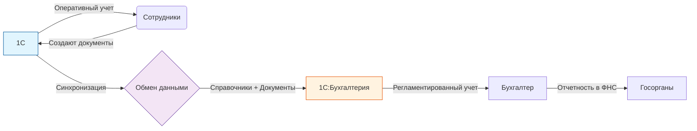

# 🔗 Инструкция: Настройка синхронизации 1С ↔ 1С:Бухгалтерия
**ООО «КБМ» | Версия: 1.0 | Дата: 21.03.2026**

| **Ответственные** | Администратор 1С, Главный бухгалтер                                                                     |
| :--- |:--------------------------------------------------------------------------------------------------------|
| **Цель** | Организация автоматического обмена данными между оперативным контуром 1C и бухгалтерским контуром (БП). |
| **Режим обмена** | 🔄 **Односторонний:** Из текущей конфигурации в Бухгалтерию. Ввод первички в БП запрещен.               |
| **Статус** | ✅ Готов к исполнению                                                                                    |

---

## 1. 🎯 Цель и принципы работы

Для разделения труда в ООО «КБМ» используется двухконтурная система:
1.  **1С (Управление нашей фирмой):** Ведет весь оперативный учет (продажи, закупки, производство, склад, зарплата, CRM). Здесь работают менеджеры, снабженцы, мастера цехов.
2.  **1С:Бухгалтерия предприятия (БП):** Ведет регламентированный учет (налоги, проводки, отчетность в ФНС/ПФР). Здесь работает только бухгалтерия.

### 🔑 Ключевые принципы
*   **Единая истина:** Первичные документы создаются **только в 1С**.
*   **Автоматизация:** Данные (справочники и документы) автоматически передаются в БП через синхронизацию.
*   **Запрет дублирования:** В Бухгалтерии запрещено вручную создавать поступления, реализации или начисления зарплаты, если они есть в текущую реализацию.
*   **Безопасность:** Перед первой настройкой обязательно создаются резервные копии обеих баз.

> 💡 **Контекст для КБМ:**
> Производственные документы (Заказы на производство, Отчеты за смену, Требования-накладные) **НЕ передаются** в Бухгалтерию. В БП попадает только итоговый финансовый результат этих операций (себестоимость выпуска, списание материалов), рассчитанный в УНФ после закрытия месяца (или документально, если настроена передача затрат). *Примечание: В стандартной связке УНФ→БП обычно передаются документы поступления, реализации, касса/банк и начисление зарплаты. Производственные затраты могут передаваться сводно или детально в зависимости от настроек.*

---

## 2. 🏗 Схема взаимодействия

**Что передается из текущей конфигурации в БП:**
*   ✅ **Справочники:** Организации, Контрагенты, Договоры, Номенклатура, Сотрудники, Статьи затрат.
*   ✅ **Документы:** Поступление товаров/услуг, Реализация, Возвраты, Касса (ПКО/РКО), Банк (Платежки), Начисление зарплаты, Ввод косвенных расходов.
*   ❌ **Не передается:** Заказы на производство, Наряд-задания, Отчеты производства за смену (остаются в УНФ для управленческого учета).

---

## 3. 🛠 Этап 1: Подготовка к настройке

### 3.1. Проверка версий
Убедитесь, что конфигурации обновлены до актуальных релизов:
*   **1С:** ред. 3.0 (последний релиз).
*   **1С:Бухгалтерия:** ред. 3.0 (последний релиз).
*   **Платформа 1С:** Предприятие 8.3 (версии должны быть совместимы).

### 3.2. Резервное копирование (Критично!)
Перед любыми действиями сделайте полные резервные копии обеих баз данных.
*   `Администрирование` → `Выгрузить информационную базу`.

### 3.3. Чистка данных (Pre-Sync Check)
Чтобы избежать дублей при обмене:
1.  **В Бухгалтерии:** Запустите обработку `Поиск и удаление дублей контрагентов`. Удалите лишние карточки.
2.  **В 1С:** Проверьте, что у всех контрагентов заполнен **ИНН**. Это главный ключ для автоматического сопоставления.
3.  **Организации:** Убедитесь, что наименования и ИНН организации в обеих базах совпадают полностью.

---

## 4. ⚙️ Этап 2: Настройка в 1С (Источник)

### 4.1. Включение синхронизации
**Путь:** `Настройки` → `Синхронизация данных`.
1.  Установите галочку **«Синхронизация данных»**.
2.  Нажмите кнопку **Создать**.

### 4.2. Выбор типа подключения
В списке приложений выберите: **«1С:Бухгалтерия предприятия, ред. 3.0»**.

Выберите способ соединения:
*   **Прямое подключение:** Если базы на одном сервере/ПК. Укажите путь к файлу базы БП (`.1CD`) или имя информационной базы в списке запуска.
*   **Через файлы:** Если базы на разных компьютерах. Укажите общую сетевую папку, доступную обоим ПК.
*   **Через сервис 1С:** Если базы в облаке (1С:Фреш).

### 4.3. Настройка правил обмена
После проверки подключения откроется окно настроек.

| Параметр | Рекомендуемое значение         | Комментарий |
| :--- |:-------------------------------| :--- |
| **Направление** | Из этой программы (1С)         | Мы отправляем данные в БП. |
| **Справочники** | Отправлять только используемые | Чтобы не засорять БП лишней номенклатурой. |
| **Дата начала обмена** | `01.04.2026`                   | Дата начала работы в новой системе. |
| **Документы** | Выбрать виды                   | Отметьте галочками только нужные (см. ниже). |

**✅ Список документов для передачи:**
*   Поступление товаров и услуг.
*   Реализация товаров и услуг.
*   Возвраты товаров.
*   Поступление/Списание безналичных ДС.
*   Приходный/Расходный кассовый ордер.
*   Начисление зарплаты и взносов.
*   Ввод косвенных расходов.

**❌ Исключить (не передавать):**
*   Заказы покупателей/поставщиков (в БП они не нужны, только факты).
*   Заказы на производство, Отчеты производства, Наряд-задания.
*   Перемещения товаров внутри склада.

Нажмите **Записать и закрыть**.

---

## 5. ⚙️ Этап 3: Настройка в 1С:Бухгалтерии (Приемник)

### 5.1. Включение приема
**Путь:** `Администрирование` → `Синхронизация данных`.
1.  Установите галочку **«Использовать синхронизацию данных»**.
2.  В списке должна появиться созданная настройка (она подтянется автоматически, если базы видят друг друга). Если нет — создайте новую аналогично п. 4.

### 5.2. Установка запрета загрузки
Чтобы старые документы не «прилетели» задним числом и не порушили закрытые периоды:
1.  Нажмите на ссылку **«Даты запрета загрузки данных»**.
2.  Установите дату запрета: **`31.03.2026`** (день перед стартом).
3.  Сохраните.

### 5.3. Настройка направления
В параметрах синхронизации убедитесь, что стоит режим:
*   **Из 1С в Бухгалтерию.**
*   Опция «Отправлять данные из Бухгалтерии» должна быть выключена (или настроена выборочно, если нужно передавать только платежки из банка, но лучше все платежи делать в УНФ).

---

## 6. 🤝 Этап 4: Сопоставление данных (Самый важный шаг!)

Перед первым полноценным обменом необходимо告诉 системе, что «ООО Ромашка» в 1С и «ООО Ромашка» в БП — это один и тот же клиент.

1.  В окне синхронизации (в любой из баз) нажмите кнопку **Сопоставить данные**.
2.  Система предложит выполнить **автоматическое сопоставление**. Запустите его.
    *   Сопоставление идет по: ИНН, Наименованию, Артикулу (для номенклатуры).
3.  **Ручная проверка:**
    *   Откройте отчет о сопоставлении.
    *   Найдите строки со статусом **«Не сопоставлено»**.
    *   Вручную свяжите объекты (выберите пару из левой и правой колонки).
    *   Особое внимание уделите **Организациям** и **Статьям затрат** (чтобы зарплата упала на правильный счет).
4.  После завершения нажмите **«Закончить сопоставление»**.

> ⚠️ **Внимание:** Если пропустить этот этап, в Бухгалтерии появятся дубли контрагентов («ООО Ромашка» и «ООО Ромашка (2)»), что приведет к разрыву взаиморасчетов.

---

## 7. 🚀 Этап 5: Первый запуск и проверка

### 7.1. Выполнение обмена
В 1С нажмите кнопку **Синхронизировать**.
*   Дождитесь окончания процесса.
*   Посмотрите протокол: должно быть написано «Обмен завершен успешно». Ошибок быть не должно.

### 7.2. Контроль в 1С:Бухгалтерии
Зайдите в базу БП и проверьте:
1.  **Справочники:** Появились ли новые контрагенты и номенклатура? (`Справочники` → `Контрагенты`).
2.  **Документы:** Появились ли поступления и реализации за текущий период? (`Отчеты` → `Универсальный отчет` или журналы документов).
3.  **Проводки:** Проведите любой прилетевший документ и посмотрите проводки (Дт 60 – Кт 51 и т.д.). Они должны сформироваться корректно.

---

## 8. ⏰ Регламент обслуживания

### 8.1. Автоматическая синхронизация
Рекомендуется настроить расписание:
*   **Путь:** `Настройки синхронизации` → `Сценарии`.
*   **Интервал:** Каждые 30–60 минут в рабочее время.
*   Это позволит бухгалтеру видеть актуальные данные почти в реальном времени.

### 8.2. Действия при ошибках
Если синхронизация выдает ошибку:
1.  Прочитайте текст ошибки в протоколе.
2.  Частые причины:
    *   «Объект заблокирован другим пользователем» → Попросите бухгалтера выйти из базы на минуту.
    *   «Не заполнен обязательный реквизит» → Найдите документ в 1С и заполните поле (например, ставку НДС).
3.  Исправьте причину и нажмите **Синхронизировать** снова.

### 8.3. Перед закрытием месяца
1.  Убедитесь, что все документы за месяц ушли из текущей конфигурации в БП.
2.  Только после этого бухгалтер может приступать к закрытию месяца в Бухгалтерии.

---

## 9. ⛔ Типичные проблемы и решения

| Проблема | Причина                                                                   | Решение |
| :--- |:--------------------------------------------------------------------------| :--- |
| **Дубли контрагентов в БП** | Не выполнено сопоставление перед первым запуском.                         | Использовать обработку «Поиск и удаление дублей» в БП, затем пересинхронизировать. |
| **Документы не приходят в БП** | Неверная дата начала обмена или дата запрета загрузки.                    | Проверить настройки дат в обеих базах. |
| **Ошибка «Нет прав доступа»** | Пользователь 1С не имеет прав на чтение базы БП (при прямом подключении). | Дать права на файловую папку БП или проверить права пользователя 1С. |
| **Зарплата не проходит на 70 счет** | Не сопоставлены статьи затрат или виды начислений.                        | Зайти в сопоставление данных и вручную связать статью «Зарплата» из УНФ со счетом 70 в БП. |
| **НДС считается неверно** | В карточке номенклатуры в УНФ не указана ставка НДС.                      | Исправить ставку в номенклатуре УНФ и перепровести документы. |

---

## 10. ✅ Чек-лист настройки

- [ ] Созданы резервные копии обеих баз.
- [ ] Версии конфигураций обновлены.
- [ ] В 1С у всех контрагентов заполнен ИНН.
- [ ] В БП удалены явные дубли контрагентов.
- [ ] В 1С создана настройка синхронизации с БП.
- [ ] Выбраны только необходимые виды документов для передачи.
- [ ] В БП установлена дата запрета загрузки (до старта).
- [ ] Выполнено полное сопоставление справочников (автоматическое + ручное).
- [ ] Первая синхронизация прошла без ошибок.
- [ ] В БП проверено наличие документов и проводок.
- [ ] Настроен автоматический график обмена (опционально).

---

## 11. 📎 Приложение: Быстрые ссылки

| Действие | Путь в 1С                            | Путь в БП |
| :--- |:-------------------------------------| :--- |
| Настройка синхронизации | `Настройки` → `Синхронизация данных` | `Администрирование` → `Синхронизация данных` |
| Запуск обмена | Кнопка `Синхронизировать`            | Кнопка `Синхронизировать` |
| Сопоставление данных | В окне синхронизации → `Сопоставить` | В окне синхронизации → `Сопоставить` |
| Даты запрета | —                                    | `Администрирование` → `Синхронизация` → `Даты запрета` |
| Поиск дублей | —                                    | `Администрирование` → `Обслуживание` → `Поиск и удаление дублей` |

---
*Документ разработан для внутреннего использования ООО «КБМ». Копирование без согласования запрещено.*

