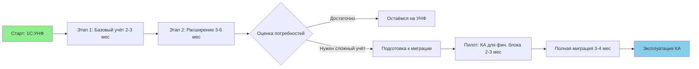

# 🎯 Резюме: Стратегия внедрения 1С для производственного предприятия

> **Дата:** Март 2026  
> **Цель документа:** Обоснование выбора стартовой платформы 1С с учётом человеческого фактора, стоимости внедрения и долгосрочной стратегии развития

---

## 📋 Executive Summary

| Критерий | 1С:УНФ | 1С:Комплексная автоматизация (КА) |
|----------|--------|-----------------------------------|
| **Порог вхождения** | 🟢 Низкий — интуитивный интерфейс, минимум настроек | 🔴 Высокий — требует понимания принципов бухучета и методологии 1С |
| **Стоимость лицензий** | 💰 Базовая (в 3–5 раз дешевле КА) | 💰💰💰 Премиум (клиентские + серверные + функциональные лицензии) |
| **Время внедрения** | ⏱️ 2–4 месяца | ⏱️ 6–12+ месяцев |
| **Необходимость обучения** | 🎓 Минимальное (1–3 дня на роль) | 🎓🎓🎓 Глубокое (недели/месяцы + сертифицированные специалисты) |
| **Гибкость настройки** | 🔧 Ограниченная, но достаточная для МСБ | ⚙️ Максимальная, но требует программиста 1С |
| **Регламентированный учет** | 📑 Базовый / опциональный | 📑📑📑 Полноценный, встроенный |
| **Масштабируемость** | 📈 До ~100 пользователей, умеренная сложность процессов | 🚀 Неограниченная, для холдингов и сложных структур |

> 💡 **Ключевой вывод:** Для сотрудников без опыта работы в 1С старт с **1С:УНФ** снижает риски, ускоряет получение первого результата и создаёт фундамент для плавного перехода на КА в будущем.

---

## ⚠️ Риски старта с 1С:Комплексная автоматизация

### 🧑‍💼 Человеческий фактор
```
❌ Сотрудники без опыта 1С сталкиваются с:
   • Перегруженным интерфейсом (разделы: "Регламентированный учет", "Казначейство", "Бюджетирование")
   • Необходимостью различать управленческий и бухгалтерский документы
   • Сложной аналитикой (ЦФО, проекты, статьи затрат с иерархией)
   • Регламентными операциями закрытия месяца

❌ Последствия:
   • Сопротивление изменениям, саботаж внедрения
   • Ошибки в документах → искажение отчётности
   • Зависимость от внешних консультантов на постоянной основе
```

### 💰 Финансовые риски
```
❌ Прямые затраты:
   • Лицензии: сервер + клиентские + функциональные модули
   • Внедрение: 500–2000+ человеко-часов работы специалистов
   • Обучение: сертифицированные курсы для ключевых пользователей

❌ Косвенные затраты:
   • Простой процессов на этапе освоения
   • Дублирование учёта в старых системах "на подстраховку"
   • Риск "заморозки" проекта при превышении бюджета
```

### ⏱️ Временные риски
````
❌ Реалистичный сценарий внедрения КА "с нуля":
````
   | Этап | Срок |
   |------|------|
   | Предпроектное обследование | 2–4 недели |
   | Настройка НСИ и прав доступа | 3–6 недель |
   | Обучение ключевых пользователей | 2–4 недели |
   | Пилотная эксплуатация | 4–8 недель |
   | Полномасштабный запуск | +2–4 недели |
   | Стабилизация и доработки | 2–3 месяца |
   | **ИТОГО** | **6–12 месяцев** |

````
❌ В этот период предприятие работает в режиме "двойного учёта", что снижает эффективность.
````

---

## ✅ Преимущества старта с 1С:УНФ

### 🎯 Быстрый старт
```
✅ Интуитивный интерфейс:
   • Разделы сгруппированы по бизнес-ролям ("Продажи", "Производство", "Склад")
   • Минимум обязательных полей, подсказки в интерфейсе
   • Единый документ "Заказ" для продаж и производства (упрощает логику)

✅ Сокращённое обучение:
   • 1–3 дня на освоение базовых операций для рядового сотрудника
   • Возможность поэтапного подключения модулей (склад → производство → финансы)
```

### 💰 Контроль бюджета
```
✅ Предсказуемые затраты:
   • Лицензии: в 3–5 раз дешевле КА
   • Внедрение: 100–400 человеко-часов (в зависимости от объёма)
   • Обучение: внутренние инструкции + краткие сессии с консультантом

✅ Гибкая модель масштабирования:
   • Можно начать с 3–5 рабочих мест и наращивать по мере необходимости
   • Функционал растёт вместе с потребностями бизнеса
```

### 📈 Подготовка к переходу на КА
```
✅ Единая методология 1С:
   • Справочники (Контрагенты, Номенклатура, Статьи затрат) имеют схожую структуру
   • Документы "Заказ клиента", "Реализация", "Отчёт производства" концептуально идентичны
   • Пользователи осваивают логику платформы без перегрузки деталями

✅ Плавная миграция данных:
   • Конвертация из УНФ в КА поддерживается штатными средствами 1С
   • Накопленная НСИ и история операций переносятся автоматически
   • Сотрудники продолжают работать в знакомой парадигме, осваивая новые функции постепенно

✅ Сохранение темпа бизнеса:
   • Учёт работает "здесь и сейчас", не дожидаясь завершения многомесячного внедрения
   • Нет периода "двойного учёта" — данные сразу в одной системе
```

---

## 🗺️ Рекомендуемая дорожная карта



### 📌 Этап 1: Базовое внедрение УНФ (2–3 месяца)
| Задача | Результат |
|--------|-----------|
| Настройка НСИ (контрагенты, номенклатура, склады) | Готовая база для работы |
| Обучение ключевых пользователей по ролям | Сотрудники умеют создавать основные документы |
| Запуск контура: Продажи → Склад → Производство | Сквозной учёт в одной системе |
| Настройка базовых отчётов для руководителя | Прозрачность операций "здесь и сейчас" |

### 📌 Этап 2: Расширение функционала (3–6 месяцев)
| Задача | Результат |
|--------|-----------|
| Подключение финансов: Платёжный календарь, Статьи затрат | Контроль ДС и себестоимости |
| Настройка аналитики по проектам / подразделениям | Детализация прибыльности |
| Автоматизация закупок по потребностям | Снижение ручного планирования |
| Интеграция с сайтом / маркетплейсами (опционально) | Ускорение обработки заказов |

### 📌 Этап 3: Оценка и решение (по достижении зрелости)
```
✅ Критерии для рассмотрения перехода на КА:
   • Штат > 100 пользователей
   • Необходимость полноценного регламентированного учёта в той же базе
   • Сложная структура холдинга с консолидацией
   • Требования к бюджетированию со сценариями и правилами

❌ Если критерии не достигнуты:
   • УНФ продолжает покрывать потребности
   • Инвестиции направляются в развитие бизнес-процессов, а не в ИТ-инфраструктуру
```

### 📌 Этап 4: Плавная миграция на КА (при необходимости)
| Задача | Преимущество подхода |
|--------|---------------------|
| Пилотное внедрение КА для финансового блока | Ключевые специалисты осваивают сложный функционал без остановки операционной деятельности |
| Поэтапный перенос подразделений | Минимизация рисков, возможность корректировки на ходу |
| Обучение на базе уже знакомых процессов | Сотрудники фокусируются на новых возможностях, а не на базовой навигации |
| Параллельная работа в период перехода | Гарантированная непрерывность учёта |

---

## 🧮 Сравнительная оценка совокупной стоимости владения (3 года)

| Статья расходов | 1С:УНФ | 1С:КА | Комментарий |
|-----------------|--------|-------|-------------|
| Лицензии (10 раб. мест + сервер) | ~300–500 тыс. ₽ | ~1.5–2.5 млн ₽ | Цены ориентировочные, без учёта ИТС |
| Внедрение (услуги) | ~400–800 тыс. ₽ | ~2–5 млн ₽ | Зависит от сложности процессов |
| Обучение сотрудников | ~50–150 тыс. ₽ | ~300–800 тыс. ₽ | Включая время простоя на освоение |
| Поддержка (год) | ~100–200 тыс. ₽ | ~400–900 тыс. ₽ | ИТС-проф, обновления, консультации |
| **ИТОГО (3 года)** | **~1.2–2.5 млн ₽** | **~5–12 млн ₽** | **Разница: 4–5×** |

> 💡 **Вывод:** За те же средства, что потребуются на внедрение КА, можно:
> - Внедрить УНФ + обучить команду + получить 2 года стабильной эксплуатации
> - Или: внедрить КА, но с риском не выйти на полную мощность в срок

---

## 🎯 Итоговые рекомендации

### ✅ Выбирайте 1С:УНФ, если:
- [ ] Сотрудники не имеют опыта работы в 1С или работали только с базовыми конфигурациями
- [ ] Бюджет на внедрение ограничен или требует поэтапного финансирования
- [ ] Необходимо получить результат "здесь и сейчас", а не через 6–12 месяцев
- [ ] Процессы предприятия укладываются в типовую функциональность УНФ
- [ ] Вы хотите снизить зависимость от внешних консультантов в повседневной работе

### ✅ Рассматривайте 1С:КА, если:
- [ ] Предприятие уже использует 1С:Бухгалтерию / 1С:УПП и требуется консолидация
- [ ] Есть штатный специалист 1С или партнёр с долгосрочным контрактом поддержки
- [ ] Требуется полноценный регламентированный учёт в единой базе с управленческим
- [ ] Планируется масштабирование до уровня холдинга со сложной структурой
- [ ] Бюджет и сроки позволяют провести полноценное внедрение с обучением

### 🔄 Универсальная стратегия:
```
1️⃣ Старт с 1С:УНФ → быстрый результат, низкие риски, обучение команды
2️⃣ Эксплуатация 1.5–3 года → накопление данных, отладка процессов, оценка реальных потребностей
3️⃣ Принятие решения: остаться на УНФ или мигрировать на КА на подготовленной основе
```

> 🎯 **Главный принцип:** Технология должна служить бизнесу, а не бизнес — технологии.  
> Выбор платформы — это не вопрос "что мощнее", а вопрос "что эффективнее для ваших людей и процессов сегодня".

---

## 📎 Приложения

### Приложение А: Чек-лист готовности к КА
```
□ Есть сертифицированный специалист 1С в штате или на аутсорсе
□ Проведено предпроектное обследование с описанием всех бизнес-процессов
□ Ключевые пользователи прошли обучение по методологии 1С:КА
□ Выделен бюджет на 12+ месяцев внедрения с резервом 20–30%
□ Руководство готово к периоду "двойного учёта" и временному снижению операционной эффективности
```

### Приложение Б: План обучения для старта с УНФ
```
Неделя 1: 
   • Администратор: установка, базовая настройка, права доступа
   • Ключевые пользователи: обзор интерфейса, навигация, создание справочников

Неделя 2:
   • Ролевое обучение: Продажи / Склад / Производство / Финансы (по 4–8 часов на роль)
   • Практика на тестовой базе: сквозной сценарий "Заказ → Производство → Отгрузка"

Неделя 3:
   • Запуск в промышленную эксплуатацию (пилотная группа)
   • Ежедневные 15-минутные стендапы для разбора вопросов

Неделя 4+:
   • Подключение остальных пользователей
   • Настройка отчётов для руководителя
   • Переход на штатный режим поддержки
```

---

> 📝 **Документ подготовлен для принятия управленческого решения.**  
> Рекомендуется обсудить с ключевыми стейкхолдерами: руководителем, финансовым директором, ИТ-ответственным и представителями подразделений.

*Версия: 1.0 | Автор: Андрей Абрамов | Дата: Март 2026*

